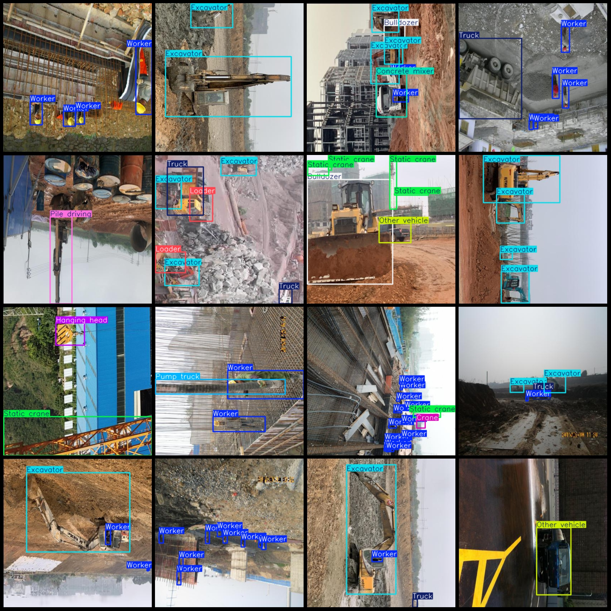
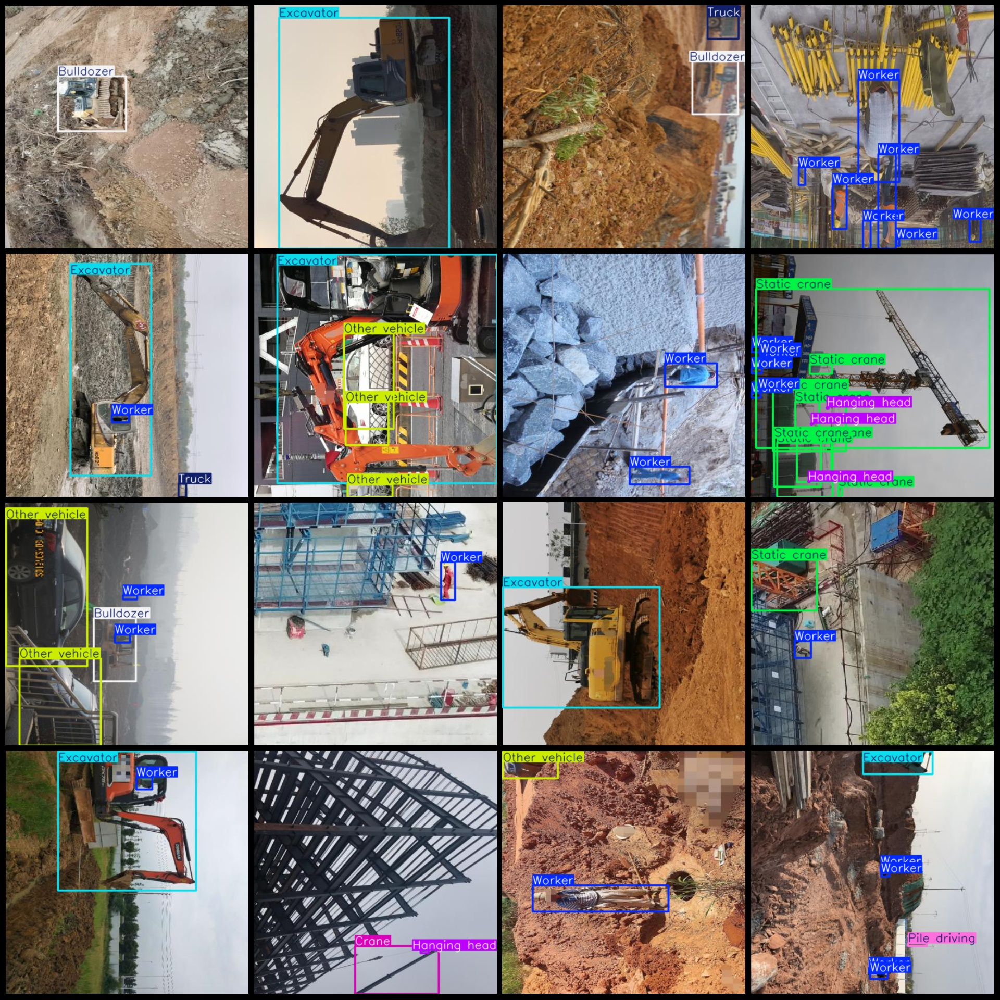

# Smart Construction Dataset: Vehicles and Workers Inspection in the Construction Site with VOC+YOLO Format and 9236 Images in 13 Categories

Dataset format: Pascal VOC format + YOLO format (txt files without segmentation paths, only containing JPG images and corresponding VOC format xml files and yolo format txt files)
Number of images (JPG file count): 9236
Number of annotations (xml file count): 9236
Number of annotations (txt file count): 9236
Number of annotation categories: 13
Annotation category names (Note that the order of categories in the yolo format does not correspond to this, but is based on the classes.txt in the labels folder): ["Bulldozer", "Concrete mixer", "Crane", "Excavator", "Hanging head", "Loader", "Other vehicle", "Pile driving", "Pump truck", "Roller", "Static crane", "Truck", "Worker"]
Each category of annotations has:
Bulldozer (bulldozer) boxes = 478
Concrete mixer (concrete mixer) boxes = 688
Crane (crane) boxes = 1217
Excavator (excavator) boxes = 4448
Hanging head (head/lifting arm) boxes = 1240
Loader (loader) boxes = 408
Other vehicle (other vehicles) boxes = 2410
Pile driving (pile driving) boxes = 411
Pump truck box count = 613
Roller box count = 410
Static crane box count = 3435
Truck box count = 2379
Worker box count = 35788
Application: Common machinery and personnel in construction site.
total boxes: 53925  
image resolution: 416x416  
Use annotation tool: labelImg
Annotation rules: draw a rectangle around the class.
Important notes: There are no specific notes at this time.
Special statement: This dataset does not guarantee the accuracy of the trained model or weight file.
Image preview:
## Images

Here is a pay link on Stripe ( https://buy.stripe.com/3cs8yP7sY87d0vu9AB ). Please contact me lonlonago@foxmail.com after funding $89, and I will send you a complete data files , thank you!

